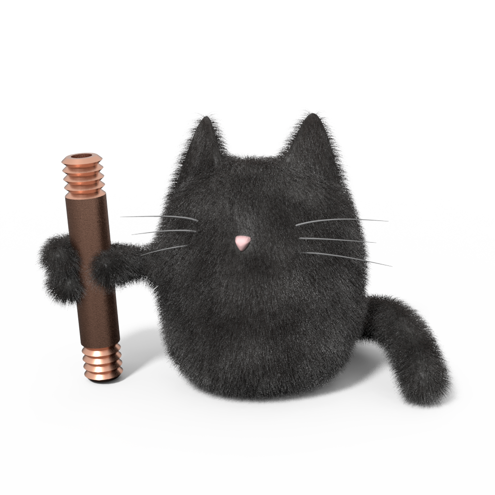

# Welcome!

Buildcat is the elegant, minimalist render farm based on [RQ](http://python-rq.org), featuring:

* Support for any platform that can run Python.
* Thorough [documentation](https://buildcat.readthedocs.io).

You can see the full Buildcat documentation with tutorials at
https://buildcat.readthedocs.io ... for questions, comments, or suggestions, get
in touch with our team at https://buildcat.zulipchat.com.

License
=======

Copyright 2018 Timothy M. Shead

   Licensed under the Apache License, Version 2.0 (the "License");
   you may not use this file except in compliance with the License.
   You may obtain a copy of the License at

       http://www.apache.org/licenses/LICENSE-2.0

   Unless required by applicable law or agreed to in writing, software
   distributed under the License is distributed on an "AS IS" BASIS,
   WITHOUT WARRANTIES OR CONDITIONS OF ANY KIND, either express or implied.
   See the License for the specific language governing permissions and
   limitations under the License.
